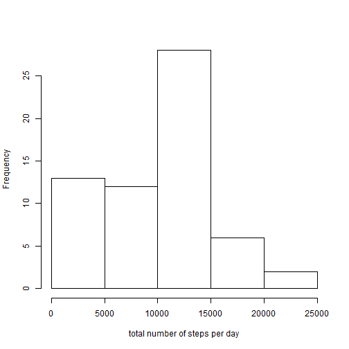
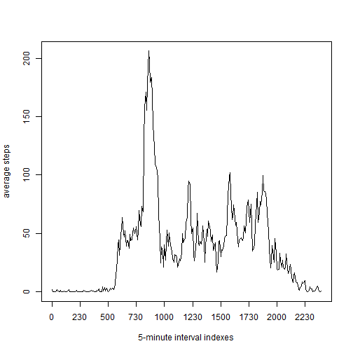
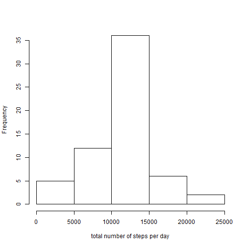
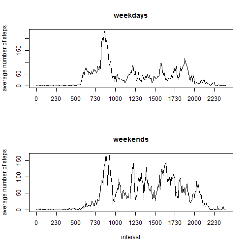

Reproducible Research: Peer Assessment 1
=================================================================


```r
opts_chunk$set(echo = TRUE)
library(reshape2)
```

## Introduction

The “quantified self” movement is a group of enthusiasts who take measurements about themselves regularly to improve 
their health, to find patterns in their behavior, or because they are tech geeks. 

Here, we are going to make use of 
data from a personal activity monitoring device. This device collects data at 5 minute intervals through out the day. 
The data consists of two months of data from an anonymous individual collected during the months of October and November, 
2012 and include the number of steps taken in 5 minute intervals each day.

To reproduce this analysis "reshape2", "timeDate" and "knitr" packages will be needed.

## The data

The data is stored in a comma-separated-value (CSV) file and there are a total of 17,568 observations in this dataset. 
The variables included in this dataset are:
 - steps   : Number of steps taking in a 5-minute interval (missing values are coded as NA)
 - date    : The date on which the measurement was taken in YYYY-MM-DD format
 - interval: Identifier for the 5-minute interval in which measurement was taken

We load the data from the file activity.csv (provided it is in the working directory):

```r
data <- read.csv("activity.csv")
```
We can have a look at the loaded data set: the structure of the data frame 

```r
str(data)
```

```
## 'data.frame':	17568 obs. of  3 variables:
##  $ steps   : int  NA NA NA NA NA NA NA NA NA NA ...
##  $ date    : Factor w/ 61 levels "2012-10-01","2012-10-02",..: 1 1 1 1 1 1 1 1 1 1 ...
##  $ interval: int  0 5 10 15 20 25 30 35 40 45 ...
```
and some of the first rows

```r
head(data)
```

```
##   steps       date interval
## 1    NA 2012-10-01        0
## 2    NA 2012-10-01        5
## 3    NA 2012-10-01       10
## 4    NA 2012-10-01       15
## 5    NA 2012-10-01       20
## 6    NA 2012-10-01       25
```
It seems that only the 'steps' column contains NA's, but for us to be sure of this, let's compute the number of NA's 
presents in each column:

```r
sum(is.na(data$steps))
```

```
## [1] 2304
```

```r
sum(is.na(data$date))
```

```
## [1] 0
```

```r
sum(is.na(data$interval))
```

```
## [1] 0
```
So, there are no NA's in the other two columns.


## Total number of steps per day

Ignoring the missing values by the moment, the following picture is an histogram
of the total number of steps taken each day:

```r
data_melt <- melt(data, id = c("date", "interval"), measure.vars = "steps")

steps_per_day <- dcast(data_melt, date ~ variable, sum, na.rm = TRUE)
colnames(steps_per_day) <- c("date", "total_steps")

hist(steps_per_day$total_steps, xlab = "total number of steps per day", main = "")
```

 

And below, we compute the mean and the median total number of steps taken per day:

```r
mean(steps_per_day$total_steps)
```

```
## [1] 9354
```

```r
median(steps_per_day$total_steps)
```

```
## [1] 10395
```


## Average daily activity pattern

If we average the number of steps taken in each 5-minute interval across all days

```r
average_steps_per_interval <- dcast(data_melt, interval ~ variable, mean, na.rm = TRUE)
colnames(average_steps_per_interval) <- c("interval", "average_steps")
```
we can plot the next series plot that shows the daily activity pattern:

```r
plot(average_steps_per_interval$average_steps, 
	type = "l", 
	xlab = "5-minute interval indexes", 
	ylab = "average steps",
	xaxt = "n")
ticks <- seq(from = 1, to = 288, by = 30)
axis(side = 1, 
	at = ticks,
	labels = average_steps_per_interval$interval[ticks])
```

 

Let's order this dataframe

```r
averages_rank <- average_steps_per_interval[with(average_steps_per_interval, order(-average_steps)), ]
head(averages_rank)
```

```
##     interval average_steps
## 104      835         206.2
## 105      840         195.9
## 107      850         183.4
## 106      845         179.6
## 103      830         177.3
## 101      820         171.2
```
Hence, the maximum number of steps, on average across all the days in the dataset, can be found in the interval

```r
averages_rank[1,1]
```

```
## [1] 835
```
which correspons to

```r
835/60
```

```
## [1] 13.92
```
13:00 p.m aproximately.


## Imputing missing values

The total number of missing values in the dataset is

```r
sum(!complete.cases(data))
```

```
## [1] 2304
```
as we saw before. The presence of missing values for days/intervals may introduce bias into 
some calculations or summaries of the data. So, we dicide to fill in all the missing values
with the mean of the corresponding 5-minute interval. Here is the new data frame with the missing data filled in:

```r
full_data <- data[, 2:3]

fill_steps <- function(s, i){
	if(!is.na(s)){
		s
	}else{
		s <- average_steps_per_interval[average_steps_per_interval$interval == i, 2]
	}
}

full_data$filled_steps <- mapply(fill_steps, data$steps, data$interval)
```
Take a look at it

```r
str(full_data)
```

```
## 'data.frame':	17568 obs. of  3 variables:
##  $ date        : Factor w/ 61 levels "2012-10-01","2012-10-02",..: 1 1 1 1 1 1 1 1 1 1 ...
##  $ interval    : int  0 5 10 15 20 25 30 35 40 45 ...
##  $ filled_steps: num  1.717 0.3396 0.1321 0.1509 0.0755 ...
```

```r
head(full_data)
```

```
##         date interval filled_steps
## 1 2012-10-01        0      1.71698
## 2 2012-10-01        5      0.33962
## 3 2012-10-01       10      0.13208
## 4 2012-10-01       15      0.15094
## 5 2012-10-01       20      0.07547
## 6 2012-10-01       25      2.09434
```

With this data frame, we again make an histogram of the total number of steps taken each
day

```r
full_data_melt <- melt(full_data, id = c("date", "interval"), measure.vars = "filled_steps")

full_steps_per_day <- dcast(full_data_melt, date ~ variable, sum, na.rm = TRUE)
colnames(full_steps_per_day) <- c("date", "total_steps")

hist(full_steps_per_day$total_steps, xlab = "total number of steps per day", main = "")
```

 

and calculate the mean and median total number of steps taken per day:

```r
mean(full_steps_per_day$total_steps)
```

```
## [1] 10766
```

```r
median(full_steps_per_day$total_steps)
```

```
## [1] 10766
```

We see how these values differ from the previous one. The histogram has now a more symmetric shape and the mean and median
are basically the same value.


## Activity patterns on weekdays and weekends

We are going to create a new variable in our data frame: a factor variable with 
levels "weekday" and "weekend" indicating whether a given date is a weekday or
a weekend day.

```r
# Reformat 'date' column
full_data$date <- as.Date(full_data[, "date"], format = "%Y-%m-%d")

# New column with weekday/weekend information about the date
suppressWarnings(library(timeDate))
full_data$day_type <- as.factor(isWeekend(full_data$date))

# Rename levels of the factor 'day_type'
levels(full_data$day_type)[levels(full_data$day_type)=="FALSE"] <- "weekday"
levels(full_data$day_type)[levels(full_data$day_type)=="TRUE"] <- "weekend"

head(full_data)
```

```
##         date interval filled_steps day_type
## 1 2012-10-01        0      1.71698  weekday
## 2 2012-10-01        5      0.33962  weekday
## 3 2012-10-01       10      0.13208  weekday
## 4 2012-10-01       15      0.15094  weekday
## 5 2012-10-01       20      0.07547  weekday
## 6 2012-10-01       25      2.09434  weekday
```

In order to plot separately the activity patterns on weekdays and weekend days,
subset the data frame and take the average number of stpes taken in each the 5-minute interval, 
acrros all the days in the subset:

```r
weekdays_data <- subset(full_data, full_data$day_type == "weekday")
weekends_data <- subset(full_data, full_data$day_type == "weekend")

weekdays_data_melt <- melt(weekdays_data, id = c("date", "interval"), measure.vars = "filled_steps")
weekends_data_melt <- melt(weekends_data, id = c("date", "interval"), measure.vars = "filled_steps")

weekdays_average_steps <- dcast(weekdays_data_melt, interval ~ variable, mean)
weekends_average_steps <- dcast(weekends_data_melt, interval ~ variable, mean)

par(mfrow = c(2,1))
ticks <- seq(from = 1, to = 288, by = 30)

plot(weekdays_average_steps$filled_steps, 
	type = "l",
	xlab = "", 
	ylab = "average number of steps",
	main = "weekdays",
	xaxt = "n")
axis(side = 1, at = ticks, labels = average_steps_per_interval$interval[ticks])

plot(weekends_average_steps$filled_steps, 
	type = "l",
	xlab = "interval", 
	ylab = "average number of steps",
	main = "weekends",
	xaxt = "n")
axis(side = 1, at = ticks, labels = average_steps_per_interval$interval[ticks])
```

 

So there are clearly differences between activity pattern on weekdays and activity pattern on weekends.
For example, although the maximu activity seems to be located aproximately at the same time in both cases,
the activity previos to the peak is less on weekends than it is during the week. However, after this peak,
we observed much more activity (ie. number of steps) on weekends.


